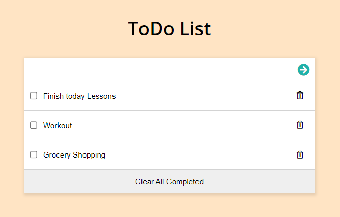

# ToDo List

**What I did in this project:**

  1. Setup webpack.
  2. Make webpack generate files auto. on /dist directory.
  3. Make list structure with styling.
  4. Add list data dynamically from the data array.
  5. Add linters files and fix its errors.

# Site Screenshots

## Built With

- HTML.
- CSS.
- Webpack.
- JavaScript.
- Linters.

## How to run locally:

1. Clone the project using git-bash or Githup Desktop.
2. Open the project folder with VSCode or any Editor.
3. Open index.html file and open with live server.
4. If you don't have live server extension install it
   or open index.html manually from your file explorer.

## Authors

👤 **Omar Muhammad**

- GitHub: [@Omar-Muhamad](https://github.com/Omar-Muhamad)
- Twitter: [@Eng_OmarMuhamad](https://twitter.com/Eng_OmarMuhamad)
- LinkedIn: [@eng-omarmuhammad](https://www.linkedin.com/in/eng-omarmuhammad/)

## Show your support

Give a ⭐️ if you like this project!
